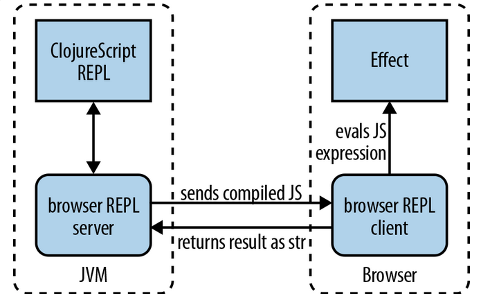

# Create new project ready for REPL-driven development
This document contains some explanation about:

- What is the motivation and the purpose of this project
- How this project is created, where to put files
- How to make clojurescript compiled
- How to use clojurescript REPL for quick development.

## Motivation

- Repl greatly speeds up development because you may see the changes
  quickly without need to build complete solution
- Repl allows for inspection of the running problem, greatly helping
  debug
- Repl allows to run code interactively in real environment, greatly
  improving profiling and performance optimisation


Sources of inspiration:

- [Modern ClojureScript](https://github.com/magomimmo/modern-cljs) -
  "official" ClojureScript tutorial talks about REPL by the tutorial
  2;
- [ClojureScriptOne](https://github.com/brentonashworth/one) - quite
  impressive demonstration of the ClojureScript application, built
  arond repl;
- [2012 State of Clojure survey](http://cemerick.com/2012/08/06/results-of-the-2012-state-of-clojure-survey/) -
  REPL is considered is the #2 "biggest win in using clojure".
  (Functional programming


More specifically, for ClojureScript, as stated by the
[ClojureScript workflow discussion](https://github.com/brentonashworth/one/wiki/Workflow#workflow):

    > When working with ClojureScript, having a good workflow is
    > essential. The first thing to know about workflow is that you should
    > be working from the REPL as much as possible. In fact, if you are
    > not spending most of your time in the REPL, you're doing it wrong.
    >
    > Using the REPL as the main way to deliver code to the browser means
    > never having to refresh the page. One could theoretically build an
    > entire application without a single page refresh. If you find
    > yourself refreshing the page after every change you make, you're
    > doing it wrong.

## Getting the ClojureScript compiling
As an initial version I pretty closely follow the
[modern-cljs/Tutorial 1](https://github.com/magomimmo/modern-cljs/blob/master/doc/tutorial-01.md).

### Adjust directory structure
I decided to follow the advice of the tuorial and separate the source
files by the language - separate tree for clojure script, and separate
tree for clojure. I see the value in knowing what is executed in a
browser and what on a server by the directory tree:

```bash
cd stats
mkdir -p src/{clj,cljs/stats}
mv src/stats/ src/clj/
```

Create the place for static resources (html, js, clojurescript).

```bash
mkdir -p resources/public/{js,css}
```

### Edit `project.clj` to allow clojure script comilation
Below are most important parameters to consider:

- Add `[lein-cljsbuild "0.3.2"]` to `:plugins`. Note that this version
  of the plugin will require upgrade of clojure to the version of *1.5.1*
- Specify the `:cljsbuild` parameter that tells what options to use
  for clojurescript compilation
    - `:builds` is a collection of the build configurations
        - `:source-paths` - where compiler will look for sources
        - `:compiler` - compiler options
            - `:output-to` - where to put generated javascript


### Create the ClojureScript file to check if compilation works
Put the first ClojureScript code into the file
`stats/src/cljs/stats/hello.cljs`:

```clojurescript
(ns experiment.stats.hello)

(.write js/document "Hello from ClojureScript")

```

### Create the HTML file to serve the ClojureScript

I follow the tutorial decision ed to use static html. They advocate it
because it is easier to outsource grapthic design. Me, I currently do
not want to bother with external library for HTML generation.

Create the file `resources/public/stats.html`:

```html
    <!doctype html>
    <html lang="en">
    <head>
        <meta charset="utf-8">
        <title>Statistics view page</title>
        <!--[if lt IE 9]>
        <script src="http://html5shiv.googlecode.com/svn/trunk/html5.js"></script>
        <![endif]-->
    </head>
    <body>
        <!-- pointing to cljsbuild generated js file -->
        <script src="js/stats.js"></script>
    </body>
    </html>
 ```

### Verify that the ClojureScript works
This is all what we need so far to verify that Clojurescript works as
expected.

Build Clojurescript:

```bash
  lein cljsbuild once
  
  #=> Compiling ClojureScript.
  #=> Compiling "resources/public/js/stats.js" from "src/cljs"...
  #=> Successfully compiled "resources/public/js/stats.js" in 7.860731
  #=> seconds.
  
  cd resources/public
  firefox resources/public/stats.html
```

You should see the web page with the *Hello from ClojureScript* text
on it.


## Setting up browser connected ClojureScript REPL
In this section I describe how to connect to the ClojureScript running
in a browser remotely from the repl.

ClojureScript browser REPL works like displayed on the picture.
It is a bit more complicated than ordinary Clojure REPL, because it
needs two components to work - server component and client component,
as shown in a picture below:



To set it up, we need couple of pieces:

- Create ClojureScript file for connection between client component
  and server component
- Compile the ClojuseScript file
- Start browser repl server
- enable connection

### Create REPL clojurescript and start server component
We add the CLJS file  `src/cljs/stats.brepl.cljs` to our project that looks like this:

```cljs
  (ns experiment.stats.brepl
    (:require [clojure.browser.repl :as repl]))
  
  (repl/connect "http://localhost:9000/repl")
```

Then compile  ClojureScript and start browser repl server component:

```bash
  ## Build clojurescript
  lein cljsbuild once
  
  ## Start CLJS browser repl server.
  lein trampoline cljsbuild repl-listen
  
  #=> Running ClojureScript REPL, listening on port 9000.
  #=> "Type: " :cljs/quit " to quit"
  #=> ClojureScript:cljs.user>
```

Do not try to interact with a browser yet, as it is not functional
yet, as client component is not running.

### Enable connection between browser and REPL server
We started our project using `compojure` template of leiningen, so we
need to start the server and navigate to our HTML page.

```bash
  ## Start ring server.
  lein ring server
```

Then load the page that uses our compiled clojurescript:

```bash
  ## Open ore reload page in a browser.
  firefox http://localhost:8080/stats.html
```

The page will contain *Hello from ClojureScript* - so, while keeping
the page open, we now can drive the browser from repl.

### Talk to browser using the opened REPL
Now we check if everything works as expected - we may start to use our
REPL. Type in the repl we are already opened:

```clojure
  ;; After the prompt ClojureScript:cljs.user>
  (+ 1 1)
  ;=> 2
 
  (js/alert "Alert sent from bREPL!")
  ;=> Repl will block, pop-up is displayed in the browser.
  ;=> nil
```

## Next step
Congratulations, now we are able to drive our browser from the REPL.
In the next step, I will use ClojureScript to update the value of the
table, as needed to display statistics.


