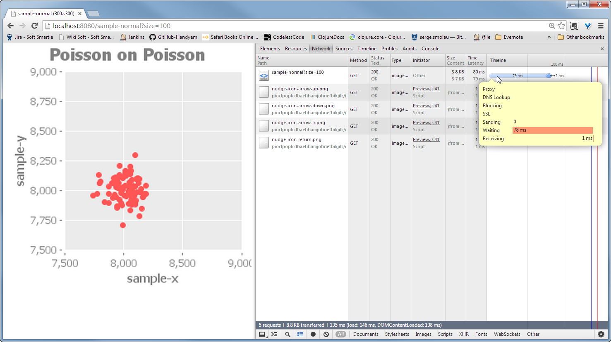

# Introduction to Webcanter

So far, this tutorial follows the
[tutorial from data-sorcery.org](http://data-sorcery.org/2009/11/29/incanter-webapp/).

The changes include updating it for the current version of Compojure,
Hiccup and Ring.

Next step would be playing with it via REPL.

## Make the tutorial build.
Initial tutorial was written for the really old version of Compojure.
Compojure was split into several pieces and the syntax of the route
definition was changed.

Key peaces are the dependencies definitions in the project:

```clojure
(defproject webcanter "0.1.0-SNAPSHOT"
  :dependencies [[org.clojure/clojure "1.5.1"]
                 [incanter "1.5.4"]
                 [ring "1.2.0"]
                 [compojure "1.1.5"]]
  :main webcanter.main)
```

Then we do proper imports:

```clojure
(ns webcanter.main
  (:use compojure.core)
  (:require [compojure.handler :as handler]
            [compojure.route :as route]
            [ring.adapter.jetty :refer [run-jetty]]
            [hiccup.core :refer [html]]
            [hiccup.form :refer [form-to submit-button text-field]]
            [hiccup.page :refer [doctype]]
            [ring.middleware.params :refer [wrap-params]]
            [incanter.core :as incanter]
            [incanter.stats :as stats]
            [incanter.charts :as charts]
            [clojure.tools.logging :as log]
            [clj-logging-config.log4j :refer [set-logger!]]
            [webcanter.nrepl :as nrepl])
  (:import (java.io ByteArrayOutputStream
                    ByteArrayInputStream)))
```

Routes are defined differently:

```clojure
;; Set URL mapping for webservice.
(defroutes webservice
  (GET "/" []
       sample-form)
  (route/resources "/")
  (wrap-params (GET "/sample-normal" [request size mean sd]
                    (gen-samp-hist-png request size mean sd))))
```

And then jetty needs to be run as a part of main function:

```clojure
;; Run webservice.
(defn -main [& args]
  (set-logger!)
  (try
    (log/info "Initializing repl")
    (nrepl/initialize)
    (nrepl/log-server-status)
    (catch Throwable t
      (log/error t "Failed to start nREPL server")))
  (run-jetty #'webservice
             {:port 8080
              :join? false}))
```

## How to run the server

- From the `webcanter` folder, run the following command: `lein run`.
  This will start the server on localhost on a port 8080.
- Then in a Chrome open the page `localhost:8080`
  The page will display the form to input the number of points to
  display in the plot. Input some number, for example: `100`
- Press the button `view`
- It will display new page with the URL like this:
  `http://localhost:8080/sample-normal?size=100`
  The plot will show the image of the scatter plot rendered as PNG.

In a future, for experiments, it is possible to change the parameter
in the URL and refresh the page to see results updated.

## Preliminary performance results
To get rough idea of the performance, it is possible to use Chrome
developer tools to calculate how long it is take to get data on the
screen:

- Open Chrome Developer tools (For example, by pressing
  `Ctrl-Shift-J`)
- In a Chrome Developer tools pick `Network` tab
- Refresh the page. Chrome will show how much time request to the
  webserver took.

The screen will look somewhat like this:



Using this crude tool as a rough metric, we could have the rough idea
of the performance:

| Number of points |      Duration   |
|-----------------:|----------------:|
|              100 |        50-60 ms |
|             1000 |        50-60 ms |
|            10000 |      200-250 ms |
|           100000 |             3 s |
|           500000 |            49 s |
|           540000 |            57 s |
|          1000000 | 3.1 min = 181 s |

We see the big jump in duration between 100000 and 500000.

Our operation is quite complex:

- Generate data
- Calculate the scatter plot
- Transform scannter plot to PNG
- Send data via HTTP


Which part takes the time?
Could it run faster?
Need to run some more specific benchmarks.

## Time of the data creation and plotting
Now I create the function that populates arbitrary dataset with the
random data.

```clojure
(defn random-data
  "Generate random dataset"
  [size]
  (take size
        (for [_ (range size)
              :let [x (rand-int 10000)
                    y (rand-int  10000)]]
          [x y])))
```

This benchmark can be done if we run the following in the REPL (change
the constant for the number of points:

```clojure
(dotimes  [j 5] (time  (do (random-dataset 540000) nil)))
```

We see that subsequent allocations are much faster.

Now we time how long does it take to allocate the memory:

| Number of points |      Duration   |
|-----------------:|----------------:|
|              100 |    0.03-0.15 ms |
|             1000 |    0.05-0.23 ms |
|            10000 |    0.04-0.48 ms |
|           100000 |    0.05-0.13 ms |
|           500000 |    0.05-0.12 ms |
|           540000 |    0.05-0.13 ms |
|          1000000 |    0.04-0.14 ms |

Quite good, we see that allocate the memory for dataset - is quite
quick. Below 0.2 mseconds in all cases.

We create couple of random datasets - for example `r-kilo` - Dataset
that contains 1000 poins, and so long, and run in the repl the
following code.

```clojure
(dotimes [_ 3] (time  (scatter-plot :x :y :data r100)))
```


Now we can time how long does it take to create the scatterplot
itself:


| Number of points |      Duration            |
|-----------------:|-------------------------:|
|              100 |      1.7  -      3.95 ms |
|             1000 |      5.83 -     13.2  ms |
|            10000 |     65.35 -    101.48 ms |
|           100000 |   1954.7  -   2217.7  ms |
|           540000 |  45610.5  -  56099.5  ms |
|          1000000 | 152891.7  - 155316.4  ms |

Quite discouraging - create `JFreeChart` object with many points at
the fly takes much more time dependingly number of plots.

Creating the scatter plot half million by halfmillion takes almost a
minute. It looks like `JFreeChart` is less optimized than one would
hope.

Display the dataset with 540000 points takes 5.71 milliseconds, but
after there is a visible delay probably a second, while the dataset
gets drawn on a screen. The time of display is about the same for
whatever number of points in dataset, which is expected.

## Calculating dencity plots with incanter.
Imagine that we reduce number of points in a scatter plot by putting
only unique points and encoding the number of points with a color.

This is very easy to do in incanter, as function `$rollup` is
specially designed for this kind of operations.

```clojure
(defn count-same-place-points
  "Takes dataset with 2 columns `:x` and `:y` and returns
   dataset that adds third column `:points-count` with the number of
    points on every coordinate."
  [data]
  ($rollup :count :points-count [:x :y] data))
```

And then we could display it in dataset by using the function like this.

```clojure
(defn scatter-plot-of-counts
  "Returns the scatter plot that groups together the points at the same place and shows them as colors."
  [dataset]
  (scatter-plot :x :y
                :group-by :points-count
                :data (count-same-place-points dataset)))
```

How long does it takes to count points at the same coordinates for
dataset?


| Number of points |      Duration            |
|-----------------:|-------------------------:|
|              100 |      0.65 -     0.77 ms  |
|             1000 |      3.31 -     3.72  ms |
|            10000 |     31.3  -    54.1 ms   |
|           100000 |   472.34  -   596.62  ms |
|           540000 |  6321.5   -  9359.30  ms |
|          1000000 | 18163.56  - 24065.92  ms |

Calculations in clojre are about 10 times faster then creation of the
JFreeChart.

How long it take to combine several datasets together?
I define synthetic dataset with the function like this:

```clojure
(defn combine-many-random-datasets
  "Sytnthetic database of many points"
  []
  ;; Merge together many datasets.
  (conj-rows r-kilo-100 r-kilo-100 r-kilo-100
             r-kilo r-kilo r-kilo r-kilo r-kilo r-kilo r-kilo r-kilo
             r100 r100 r100 r100 r100 r100 r100 r100 r100 r100 r100 r100 r100))
```
Combine 25 datasets takes around 1ms - it is quite efficient.

This dataset has about 263000 points. To calculate the counts for
points on this dataset takes about 1500 ms. To display scatter plot
with counts for this takes about 8 seconds.

## Conclusions
- JFreeChart as an implementation for the of the shelf plotting may be
  not sufficient for big number of plots. Though it would be
  interesting to check how many different plots could be in a real
  cytometric data.

- The data manipulations of incanter could be potentially interesting
  in assesing ready-made components for data manipulation. The data
  manipulation API is worth further look.
